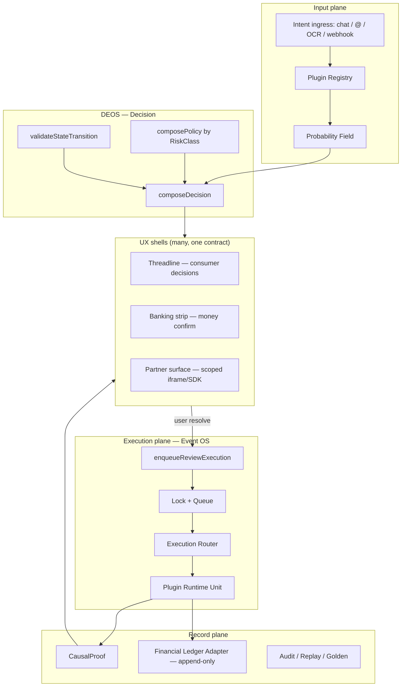
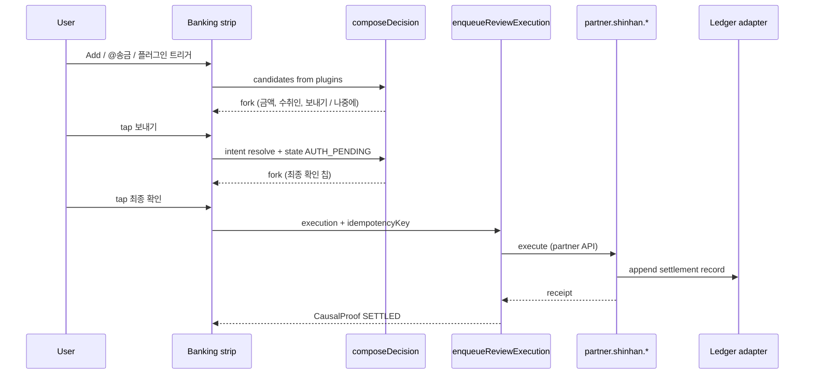
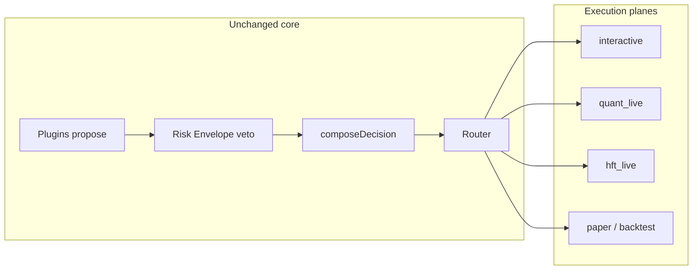
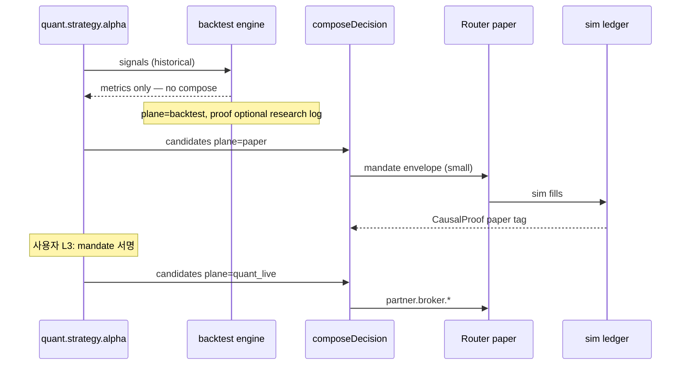

# Platform OS Architecture — Plugins, Finance, Internal/External

**Status:** DESIGN (target architecture)  
**Builds on:** [DEOS_DECISION_CONTRACT.md](./DEOS_DECISION_CONTRACT.md) · [THREADLINE_BEHAVIORAL_KERNEL_V1.md](./THREADLINE_BEHAVIORAL_KERNEL_V1.md) · Event OS (`CausalProof`, `enqueueReviewExecution`)

**한 줄:** 모든 플랫폼 행동(일정·검색·결제·송금·외부 앱 연동)은 **같은 OS 파이프라인**을 탄다. 차이는 **플러그인이 재료를 공급**하고, **리스크 등급이 정책을 바꾸는** 것뿐이다.

---

## 1. 목표

| 지금 (v1) | 나중 (Platform OS) |
|-----------|---------------------|
| `internal.ocr_review`, Command OS | **모든 도메인 = 등록된 Plugin** |
| 일정/리뷰 위주 `CandidateAction` | 결제·송금·구독·환불·KYC·외부 API 포함 |
| Threadline 3칩 fork | 리스크별 **같은 UX 규칙**, 다른 **compose 정책** |
| `CausalProof` = 일정 감사 | **금융·매매 = 동일 proof 계보 + ledger / order ledger** |
| — | **퀀트·HFT = 같은 결정 권한, 다른 실행 평면·Risk Envelope** |

**불변 원칙 (지금 문서와 동일):**

```
재료 = Plugins + Probability     (후보만)
제약 = State + Risk Policy       (가능/불가 + 금융 veto)
결정 = composeDecision()         (유일한 선택 권한)
실행 = Execution Router + Plugin runtime
기록 = CausalProof (+ 금융 ledger hook)
표현 = Surface → Threadline / Banking strip / Partner iframe shell
```

플러그인·LLM·확률 모델은 **winner를 정하지 않는다**. 금융도 예외 없음.

---

## 2. 레이어 맵



| 레이어 | 소유 | 금지 |
|--------|------|------|
| **Plugin** | `CandidateAction[]`, `becauseHint`, optional score hints | `DecisionSurface`, UI chips, `primaryAction` |
| **Probability** | `RankedCandidate[]` | `selectedCandidateId`, 금융 auto 실행 |
| **Risk Policy** | compose fork/auto 임계값, 금융 **auto 금지** | 후보 생성 |
| **State** | 전이 합법성 | 후보 선택 |
| **composeDecision** | `DecisionSurface` | 실행, SSOT 직접 변경 |
| **Execution Router** | `action.kind` → handler, idempotency | 사용자 문구 invent |
| **UX** | Surface 렌더, ingress | proof 내부 필드로 fork 구성 |

---

## 3. Plugin 모델

### 3.1 Plugin ID 네임스페이스

```
internal.<domain>          # 우리 플랫폼 일정·피드·알림
platform.<product>         # Rimvio 제품 surface (commerce, travel)
partner.<vendorId>         # 계약 B2B (은행 PSP, 카드사)
external.<connectorId>     # 사용자 연결 OAuth 앱 (Notion, Slack, …)
```

예:

- `internal.ocr_review` (현재)
- `internal.calendar`
- `platform.payment.checkout`
- `partner.shinhan.transfer`
- `external.notion.export`

### 3.2 Plugin Manifest (등록 시 고정)

```typescript
type PluginManifest = {
  pluginId: string;
  source: "internal" | "platform" | "partner" | "external";
  riskClass: RiskClass;
  capabilities: CapabilityToken[];  // 선언만, 런타임에 enforcement
  composeProfile: ComposeProfileId;
  executionAdapter: string;         // router key
  version: string;
  /** 금융/PII: 데이터 거주, 보존 기간 */
  dataClass?: "PUBLIC" | "PII" | "PCI" | "FINANCIAL";
};
```

**CapabilityToken** (예시, 확장 가능):

| Token | 의미 |
|-------|------|
| `candidate.propose` | `CandidateAction` 제출 |
| `execute.reversible` | L1 — 취소 가능 실행 |
| `execute.commit` | L2 — SSOT 커밋 |
| `execute.financial` | L3 — ledger 연동 필수 |
| `read.user_scope` | scopeId 범위 읽기 |
| `webhook.receive` | 서버→OS 인바운드 |
| `ui.embed` | Partner iframe/SDK |

외부 플러그인은 **선언된 capability ∩ 사용자 동의 ∩ Risk Policy** 교집합만 허용.

### 3.3 Plugin Runtime Unit (PRU)

각 플러그인은 두 함수만 OS에 노출:

```typescript
/** Read path — 순수, SSOT/큐 변경 없음 */
type ProposeCandidatesInput = {
  intent: UserIntent;
  state: DeosStateContext;
  scopeId: string;
  context: PluginContext;  // 시계, locale, entitlements
};

type ProposeCandidates = (input: ProposeCandidatesInput) => CandidateAction[];

/** Write path — Router가 composeDecision ACK 이후만 호출 */
type ExecuteActionInput = {
  action: CandidateAction;
  decisionId: string;      // compose 결과 correlation
  idempotencyKey: string;
  scopeId: string;
};

type ExecuteAction = (input: ExecuteActionInput) => Promise<ExecutionReceipt>;
```

`ExecutionReceipt` → Event OS가 `CausalProof`로 정규화. 플러그인이 proof를 직접 쓰지 않음.

---

## 4. Risk Class — compose·실행 정책

금융·비금융을 **같은 타입**으로 두고, **정책 프로필**으로 분기한다.

| Class | 예시 | fork | auto | 추가 제약 |
|-------|------|------|------|-----------|
| **L0** | 검색, 읽기, 미리보기 | 가능 | 가능 | — |
| **L1** | 일정 초안, 장바구니 담기 | 가능 | confidence 높을 때 | 취소 가능 TTL |
| **L2** | 캘린더 커밋, 구독 변경 | fork 우선 | 제한적 | 2단계 confirm 권장 |
| **L3** | 송금, 결제, 환불, 한도 변경 | **항상 fork** | **금지** | step-up auth, 금액 명시, ledger |
| **L4-T** | 주문·청산·레버 변경 (매매) | envelope 밖: fork | envelope 안: **mandate auto** | 주문장·포지션 한도, kill switch |
| **L4-H** | HFT 주문 스트림 | UX 칩 없음 | **batch auto** (envelope only) | rate/token bucket, coalesce proof |

### 4.1 `composePolicy(riskClass)` (Decision Engine 내부)

현재 `compose-v1` 일정 정책은 `L1`/`L2` 혼합으로 본다. 금융은 **`compose-financial-v1`** 프로필:

```typescript
// 의사코드 — 유일한 구현 위치: composeDecision (+ policy module)
if (manifest.riskClass === "L3") {
  // auto 절대 불가
  // fork 칩 ≤ 3, 반드시 "취소/나중에" escape
  // 금액·수취인·수수료가 Because 1문장 + 칩 라벨에 반영됐는지 검증
  // 동일 idempotencyKey 재요청 → blocked 또는 동일 surface 재생
}
```

### 4.2 State 확장 (금융 pending)

Threadline 4상태(`WAITING|WORKING|DONE|DEFERRED`)는 UX용. OS 내부에는 **금융 전용 gate** 추가:

```
WAITING ──► AUTH_PENDING ──► WORKING ──► SETTLED | FAILED
```

- `AUTH_PENDING`: 생체/2FA/앱 인증 대기 (칩 없음, UX는 WORKING과 동일)
- `SETTLED` / `FAILED`: proof `commitDecision` + ledger 상태와 동기
- **State validator**만 전이 허용; 플러그인이 `SETTLED`로 점프 불가

---

## 5. 금융 거래 설계 (L3)

### 5.1 CandidateAction 종류 (추가 예정)

```typescript
type CandidateActionKind =
  // … 기존 ocr_*, calendar_commit, …
  | "payment_authorize"      // 결제 승인
  | "transfer_initiate"      // 송금
  | "transfer_confirm"       // 2차 확인
  | "refund_request"
  | "limit_change"
  | "financial_defer";      // 나중에 (DEFERRED, ledger 없음)
```

`payload` (UX 비노출, router 전용):

```typescript
type FinancialPayload = {
  amountMinor: number;
  currency: string;           // ISO 4217
  counterpartyLabel: string;  // UX title/because 재료
  feeMinor?: number;
  rail: "internal" | "ach" | "card" | "partner_api";
  idempotencyKey: string;     // 필수
  regulatoryTag?: string;     // 감사 분류
};
```

### 5.2 금융 UX 규칙 (Threadline/Banking strip 공통)

| 규칙 | 이유 |
|------|------|
| **auto 모드 금지** | 금액 확정은 항상 명시적 탭 |
| Because 1문장에 **금액·상대·수수료** | 인지 부하 ↓, 분쟁 ↓ |
| 칩 라벨 = 행동 (“₩50,000 보내기”) | 모호한 “확인” 금지 |
| 실행 후 Review = ledger 요약 (읽기 전용) | split replay 대신 delta |
| 실패 시 **FAILED** + 재시도 fork (새 idempotency) | 이중 출금 방지 |

### 5.3 이중 확인 파이프라인



**핵심:** 1차 칩 = intent 확정, 2차 칩 = 금전 실행. 한 칩으로 L3 끝내지 않음 (kernel ≤3 칩과 양립: 2단계 카드 또는 2장의 WAITING 카드).

### 5.4 Ledger Adapter (SSOT 옆)

- `CausalProof` = **의사결정·실행 인과** (Event OS SSOT)
- **Ledger** = **금액 사실** (append-only, 별도 store)
- 매 `EXECUTED` L3 proof는 ledger row `proofHash` FK 필수
- Replay: proof 먼저, ledger는 멱등 키로 중복 insert 차단

플러그인은 ledger에 직접 쓰지 않음 → **Execution Router → Ledger Adapter**만 write.

---

## 6. 내부 / 외부 플러그인 통합

### 6.1 Ingress 통로 (모두 Intent로 수렴)

| Ingress | 변환 | Plugin |
|---------|------|--------|
| Threadline 칩 탭 | `UserIntent.resolve` | 해당 `action.pluginId` |
| Composer `@송금` | `UserIntent.command` | `internal.command` → compile → candidates |
| OCR / Vision | `UserIntent.add` | `internal.ocr_review` |
| Partner webhook | `UserIntent.unknown` + signed payload | `partner.*` |
| External OAuth callback | scoped token | `external.*` |

**Command OS**는 “컴파일러 플러그인”으로 유지: `@캘린더` → AST → `enqueueReviewExecution` OR `CandidateAction[]` 제안.

### 6.2 Probability + 신뢰

```typescript
type PluginTrustTier = "T0" | "T1" | "T2" | "T3";
// T0 internal, T1 platform, T2 partner contracted, T3 external user-granted
```

- `rankCandidates`에 `pluginPrior` (이미 존재) + **trust cap**: T3는 L3 후보 제안 자체 불가
- `trust_level_adjustment` (orchestrator metadata) → **Risk Policy 입력**으로 승격 (지금은 `"NONE"` 고정)

### 6.3 외부 플러그인 샌드박스

| 메커니즘 | 설명 |
|----------|------|
| **Scope grant** | 사용자가 연결한 OAuth scope만 |
| **Candidate cap** | 최대 N개, L2 이상 금지 (설정 가능) |
| **No direct SSOT** | PRU는 Router API만 |
| **Rate + budget** | scope별 일일 실행 상한 |
| **Proof redaction** | 외부에 proof 전체 export 금지, delta만 |

---

## 7. Execution Router (목표 형태)

현재 `execution_route` 문자열 분기를 **선언적 라우팅**으로 수렴:

```typescript
type ExecutionRoute = {
  kind: CandidateActionKind;
  pluginId: string;
  handler: "event_os_step" | "command_compile" | "plugin_pru" | "ledger_financial";
};

function routeExecution(action: CandidateAction, decision: ComposeDecisionResult): RoutePlan {
  const manifest = registry.get(action.pluginId);
  // L3 → 반드시 ledger_financial + lock
  // 모든 경로 → idempotencyKey 필수
  return plan;
}
```

**Queue/Lock** (`review-execution-queue`, `review-execution-lock`)는 **모든 L2+**에 공통 적용. 금융은 lock TTL + 사용자 scope 단위 직렬화.

---

## 8. CausalProof 확장 (금융)

기존 proof 스키마 유지 + **optional financial block** (breaking 없음):

```typescript
type CausalProofFinancial = {
  idempotencyKey: string;
  amountMinor: number;
  currency: string;
  ledgerEntryId: string | null;
  settlementStatus: "PENDING" | "SETTLED" | "FAILED" | "REVERSED";
  partnerReference?: string;
};
```

- UI Because / Review narrative: **템플릿 레이어**만 사용 (proof raw 필드 DOM 금지)
- Golden hash 시나리오: `financial_transfer_happy`, `financial_idempotent_replay`, `financial_failed_recover`

---

## 9. UX shells (하나의 DecisionSurface, 여러 껍데기)

| Shell | 용도 | Kernel |
|-------|------|--------|
| **Threadline** | 일상 결정 (일정, 리마인더) | v1 SHIP |
| **Banking strip** | L3 금액·2단 confirm | fork only, 동일 ≤3 칩 규칙 |
| **Partner embed** | `partner.*` UI 위임 | OS가 surface 소유, iframe은 렌더만 |
| **Feed actions** | Rimvio 링크/장소 | L0–L1, compose auto 허용 |

모든 shell은 `projectSurfaceTo*`로만 카드/칩 생성.

---

## 10. Ghost / Split vs Platform OS

| 기능 | Platform OS에서의 위치 |
|------|------------------------|
| **Ghost** (안 고른 갈래) | L3 **금지**. L0–L1만, Review 하위 optional |
| **Split** (단계 재생) | Support/감사 **콘솔 전용**, consumer UX 아님 |
| **금융 감사** | Ledger + proof replay, Threadline Review 아님 |

---

## 11. 구현 로드맵 (제안)

| Phase | 범위 | 산출물 |
|-------|------|--------|
| **P0** (현재) | OCR + Command + compose + Threadline | SHIP |
| **P1** | `PluginRegistry` + manifest 타입 + `composePolicy` 분리 | `lib/deos/plugin-registry.ts` |
| **P2** | Execution Router 테이블화 + PRU 인터페이스 | OCR/Command → PRU 이전 |
| **P3** | `L3` kinds + Banking strip + ledger adapter stub | 샌드박스 이체 시나리오 테스트 |
| **P4** | `partner.*` webhook ingress + OAuth external | 계약 PSP 1곳 |
| **P5** | Ghost(L0) 또는 Support split 콘솔 | v2 탐색 1종만 |
| **P6** | Trading kinds + Risk Envelope + paper plane | backtest golden |
| **P7** | Quant strategy PRU + broker `partner.*` | live mandate |
| **P8** | HFT hot path + batch proof snapshot | rate/kill golden |

**P1에서 할 일 (코드 침습 최소):**

1. `CandidateActionKind`에 `payment_*` / `transfer_*` reserved 추가 (runtime noop)
2. `composeDecision`에 `riskClass` 입력 (default `L1`)
3. `PluginManifest` 레지스트리 + `internal.ocr_review` 등록
4. 문서·golden 시나리오 ID만 금융 추가

**Risk Envelope stub (shipped):**

| Artifact | Path |
|----------|------|
| Types | `lib/deos/risk/risk-envelope-types.ts` |
| Order payload parse | `lib/deos/risk/order-payload.ts` |
| Veto validators | `lib/deos/risk/validate-risk-envelope.ts` |
| Compose gate | `lib/deos/decision/compose-envelope-gate.ts` (wired in `composeDecision`) |
| Compose veto test | `npx tsx scripts/test-compose-envelope-veto.ts` |
| Rate bucket | `lib/deos/risk/token-bucket.ts` |
| Test factories | `lib/deos/risk/stub-envelopes.ts` |
| Test | `npx tsx scripts/test-risk-envelope-stub.ts` |

---

## 12. 안티패턴 (절대 금지)

1. PSP/은행 API가 Threadline 칩을 직접 반환
2. LLM이 송금 금액·수취인 확정
3. `confidence > 0.9`로 L3 auto 실행
4. 플러그인이 ledger·SSOT 동시 write
5. 외부 플러그인에 `execute.financial` 기본 부여
6. proof `settlementStatus`를 UI가 파싱해 fork 구성

---

## 13. 관련 문서

- [DEOS_DECISION_CONTRACT.md](./DEOS_DECISION_CONTRACT.md) — 타입·compose 불변식
- [THREADLINE_BEHAVIORAL_KERNEL_V1.md](./THREADLINE_BEHAVIORAL_KERNEL_V1.md) — consumer UX
- [CONTEXT_INTEGRATION_1V1.md](./CONTEXT_INTEGRATION_1V1.md) — 1:1 문맥 적분, Pinned 5, Trust·**카톡급 체크리스트 §13**
- Event OS audit — `scripts/audit-event-os-integration.ts`

---

## 14. 매매·퀀트·고빈도(HFT) 확장

소비자 송금(L3)과 **증권·파생·크립토 주문**은 같은 OS이지만 **실행 평면(plane)** 과 **Risk Envelope**가 다르다. 퀀트 전략·HFT 엔진도 “특별한 winner”가 아니라 **후보를 쏟는 플러그인**이다.

### 14.1 세 가지 실행 평면 (plane)

| Plane | 사용자 | compose | 실행 큐 | Ledger |
|-------|--------|---------|---------|--------|
| **interactive** | 사람 탭 | fork (L3/L4-T 밖) | 일반 lock queue | 실계좌 |
| **quant_live** | 전략 mandate | envelope 내 auto | 우선순위 큐 | 실계좌 |
| **hft_live** | 없음(감시만) | batch compose | hot executor + cold proof | 실계좌 |
| **paper** | 개발/리허설 | 동일 정책 | sim broker | sim ledger |
| **backtest** | 오프라인 | 기록만 (실행 없음) | — | 없음 |



**불변:** plane이 `composeDecision`을 건너뛰지 않는다. HFT는 **지연·배치·생략이 아니라 축약 기록**이다.

### 14.2 Plugin 네임스페이스 (매매)

```
internal.marketdata.<feed>     # L0 — 호가·체결·지수 (read-only propose)
internal.risk.envelope         # constraint — 후보가 아님, veto만
quant.strategy.<strategyId>    # L4 — 시그널 → 주문 후보
quant.portfolio.<bookId>       # L2/L4 — 리밸런스·청산 제안
partner.broker.<venue>         # 실행 어댑터 (KIS, Binance, CQG, …)
partner.custody.<bank>         # L3 — 입출금·담보 (기존 금융)
platform.trading.ui            # Trading strip / Strategy console shell
```

- **Market data 플러그인:** `CandidateAction`을 내지 않거나 `kind: "market_subscribe"` (L0)만. 주문 후보 금지.
- **Strategy 플러그인:** `order_place_*`, `order_cancel`, `position_flatten` 후보만.
- **Broker 플러그인:** execute만; 후보 invent 금지.

### 14.3 Risk Envelope (제약 전용 — 결정 아님)

송금 L3의 “매번 탭”과 HFT “초당 수백 주문”을 한 모델로 잇는 **사전 승인 권한 상자**:

```typescript
type RiskEnvelope = {
  envelopeId: string;
  scopeId: string;
  plane: "quant_live" | "hft_live" | "paper";
  /** 사람이 L3로 서명·갱신한 mandate */
  signedAt: string;
  expiresAt: string;
  allowedSymbols: string[];       // 또는 ISIN/figi
  maxNotionalPerOrder: number;
  maxNotionalPerDay: number;
  maxOpenOrders: number;
  maxPositionQty: Record<string, number>;
  maxLeverage: number;
  orderRatePerSec: number;        // HFT token bucket
  allowedSides: ("BUY" | "SELL" | "SHORT")[];
  allowedOrderTypes: ("LIMIT" | "MARKET" | "IOC" | "FOK")[];
  killSwitch: "ARMED" | "TRIPPED";
};
```

| 검사 시점 | 동작 |
|-----------|------|
| `proposeCandidates` 후 | envelope 밖 심볼·종류 → 후보 drop |
| `composeDecision` 전 | notional/레버 초과 → `blocked` |
| `enqueue` 직전 | rate bucket, 중복 `clientOrderId` → veto |
| 런타임 | `killSwitch=TRIPPED` → 모든 L4 실행 거부, flatten 후보만 허용 |

**Human mandate (L3):** envelope 생성·증액·전략 ON은 반드시 Banking/Strategy console에서 **2단 fork**. HFT box는 “이 전략이 이 한도 안에서 자동 주문해도 된다”는 계약.

### 14.4 CandidateAction — 주문·전략

```typescript
type CandidateActionKind =
  // … financial …
  | "order_place_limit"
  | "order_place_market"
  | "order_replace"
  | "order_cancel"
  | "order_cancel_all"
  | "position_flatten"
  | "strategy_pause"      // kill — 항상 허용 후보
  | "strategy_resume";    // L3 mandate 후만

type OrderPayload = {
  clientOrderId: string;      // 멱등 — 거래소급
  symbol: string;
  side: "BUY" | "SELL";
  qty: number;
  limitPrice?: number;
  orderType: "LIMIT" | "MARKET" | "IOC" | "FOK";
  timeInForce?: string;
  strategyId?: string;
  signalId?: string;          // 퀀트 추적
  plane: "interactive" | "quant_live" | "hft_live" | "paper";
};
```

**Because 템플릿 (사람 UX):**  
`삼성전자 10주 · 지정가 72,000원 · 예상 ₩720,000 (수수료 별도)` — 한 문장.

**HFT:** 주문당 Because/UI 없음. 감시 패널은 **초당 요약**만 (주문 수, 거부 수, envelope 잔여 한도).

### 14.5 compose 프로필 — 매매

| 프로필 | 적용 | fork | auto |
|--------|------|------|------|
| `compose-v1` | 일정·피드 | 기존 | L1 |
| `compose-financial-v1` | L3 송금·결제 | 항상 | 금지 |
| `compose-trading-interactive-v1` | 수동 매매 | 항상 | 금지 |
| `compose-trading-mandate-v1` | envelope 내 quant | 금지(칩 없음) | **허용** |
| `compose-trading-hft-v1` | envelope 내 HFT | batch | **허용** |

**Mandate auto의 의미:** UI `mode: "auto"`이지만 **사람 탭이 아니라 envelope+L3 서명**이 승인 주체. Strategy·확률이 `selectedCandidateId`를 정하면 안 되고, **compose가 top 후보 선택 + envelope가 veto**.

```typescript
// compose-trading-mandate-v1 의사코드
if (!envelopeAllows(action, envelope)) return blocked;
if (action.kind === "strategy_pause") return auto; // kill 우선
return auto; // 단일 후보 또는 rank 1 — fork 생략
```

### 14.6 퀀트(Quant) 시나리오

#### A. 리서치 → 백테스트 → 페이퍼 → 라이브



| 단계 | plane | ledger | human |
|------|-------|--------|-------|
| 백테스트 | `backtest` | 없음 | 없음 |
| 페이퍼 | `paper` | sim | envelope 소액 1회 승인 |
| 라이브 | `quant_live` | 실 | mandate + kill switch |

#### B. 전략 플러그인 계약

```typescript
type StrategyManifest = {
  strategyId: string;
  pluginId: `quant.strategy.${string}`;
  assetClass: "equity" | "crypto" | "fx" | "futures";
  signalIntervalMs: number;
  maxCandidatesPerTick: number;  // OS 상한 (예: 5)
  requiresEnvelope: true;
};
```

- 전략은 **확률·LLM으로 주문 가격 확정 금지** — 규칙·모델 출력은 `limitPrice` 후보 필드일 뿐, compose·envelope가 통과시킴.
- **리밸런스:** `quant.portfolio.*`가 여러 `order_place_*` 후보 제안 → mandate compose가 묶음 실행 또는 순차 queue.

#### C. 확률 필드 (퀀트)

- `rankCandidates`: 전략 간 우선순위가 아니라 **동일 strategy 내 신호 강도**만
- 크로스 전략 winner는 **Portfolio 플러그인**이 후보 set으로 제안 → compose가 1개 또는 batch 선택

### 14.7 고빈도(HFT) 시나리오

HFT는 **다른 런타임**, **같은 결정 의미론**.

#### Hot / Cold 분리

| 경로 | 지연 | 기록 |
|------|------|------|
| **Hot** | μs–ms: envelope → compose → broker send | ring buffer: decisionId, clientOrderId, nano ts |
| **Cold** | ms–s: fill webhook → ledger → CausalProof | SSOT append, golden replay |

**Batch proof (필수):** 주문 1건당 proof 1개는 저장 폭발. OS는 **시간 창·N건 단위**로 집계 proof 생성:

```typescript
type CausalProofTradingBatch = {
  batchId: string;
  windowStart: string;
  windowEnd: string;
  decisionCount: number;
  orderCount: number;
  rejectCount: number;
  envelopeId: string;
  strategyId: string;
  topRejectReasons: string[];
  ledgerSnapshotHash: string;
  /** 개별 주문은 order_ledger FK, proof는 요약 */
};
```

감사·규제 요청 시 `order_ledger` + batch proof로 drill-down.

#### Rate · Lock · Coalesce

- **Token bucket:** `orderRatePerSec` — envelope 필드, Router ingress
- **Scope lock:** 동일 `symbol` + `strategyId` 직렬 또는 partition lock
- **Coalesce:** 동일 방향·가격 근접 limit → compose 전 merge 후보 (플러그인 제안, compose가 merge 여부 **결정**)

#### Kill switch (전역 최우선)

| 트리거 | 동작 |
|--------|------|
| 사용자 “전략 중지” 탭 | `strategy_pause` auto → cancel_all |
| envelope 한도 초과 | TRIPPED + 신규 주문 blocked |
| broker reject 폭주 | TRIPPED + 알림 |
| 일일 손실 `-X%` | TRIPPED (risk plugin veto) |

Kill 후 복구는 **L3 fork**로만 (`strategy_resume`).

### 14.8 시장 데이터 (L0) — 매매 재료

| Feed plugin | 출력 | 주문 |
|-------------|------|------|
| `internal.marketdata.krx` | 호가 스냅샷 | ❌ |
| `partner.broker.binance.ws` | 체결·봉 | ❌ |

Market data는 **Probability 입력**으로만 (유동성·스프레드 점수). **주문 winner 아님**.

### 14.9 Ledger 이중화

| Store | 내용 |
|-------|------|
| **Cash ledger** (§5.4) | 입출금·법정 통화 |
| **Order ledger** | 주문·체결·수수료·포지션 |
| **Position view** | 파생·마진 — derived, SSOT 아님 |

`CausalProof` ↔ `order_ledger` FK. HFT batch proof ↔ many order rows.

### 14.10 UX shells (매매)

| Shell | plane | 규칙 |
|-------|-------|------|
| **Trading strip** | interactive | 종목·수량·가격 fork, L4-T 밖 manual |
| **Strategy console** | mandate | envelope 편집·ON/OFF — L3 2단 |
| **HFT dashboard** | hft_live | P&L·rate·kill만; 주문별 칩 없음 |
| **Threadline** | — | 일상·알림만; 틱마다 카드 생성 **금지** |

### 14.11 Golden / 감사 시나리오 (추가 ID)

| ID | plane | 검증 |
|----|-------|------|
| `trading_manual_limit_fill` | interactive | fork → 1주문 → proof → position |
| `trading_mandate_auto_within` | quant_live | envelope OK → auto → ledger |
| `trading_mandate_block_outside` | quant_live | 심볼 밖 → blocked |
| `trading_idempotent_client_order` | any | 동일 clientOrderId 재전송 무해 |
| `trading_kill_cancel_all` | hft_live | TRIPPED → cancel_all proof |
| `hft_batch_proof_window` | hft_live | N건 → 1 batch proof, drill-down |
| `hft_rate_bucket_trip` | hft_live | 초과 → veto, no send |
| `quant_backtest_no_ledger` | backtest | 실행·ledger 0 |
| `quant_paper_sim_fill` | paper | sim ledger ≠ live |

### 14.12 안티패턴 (매매·HFT)

1. Broker WS가 Threadline 칩 직접 생성  
2. Strategy가 envelope 없이 `hft_live` 실행  
3. 확률·RL이 `composeDecision` 우회해 `broker.send`  
4. HFT 주문마다 consumer 카드·Because 생성  
5. Backtest 결과를 live ledger에 쓰기  
6. Kill switch 후 `mandate auto`로 신규 주문 허용  
7. Market data 플러그인이 `order_place_market` 후보 제안  

### 14.13 로드맵 (매매·퀀트·HFT)

| Phase | 산출 |
|-------|------|
| **P6** | `OrderPayload`, `RiskEnvelope` 타입, `compose-trading-interactive-v1`, paper plane |
| **P7** | `quant.strategy.*` PRU, mandate 서명 UX, `partner.broker` stub |
| **P8** | HFT hot executor, batch proof, rate bucket, kill golden |
| **P9** | Market data L0 plugins, surveillance read-only |

---

*Draft: 2026-06-01 · Platform OS (+ trading / quant / HFT)*

