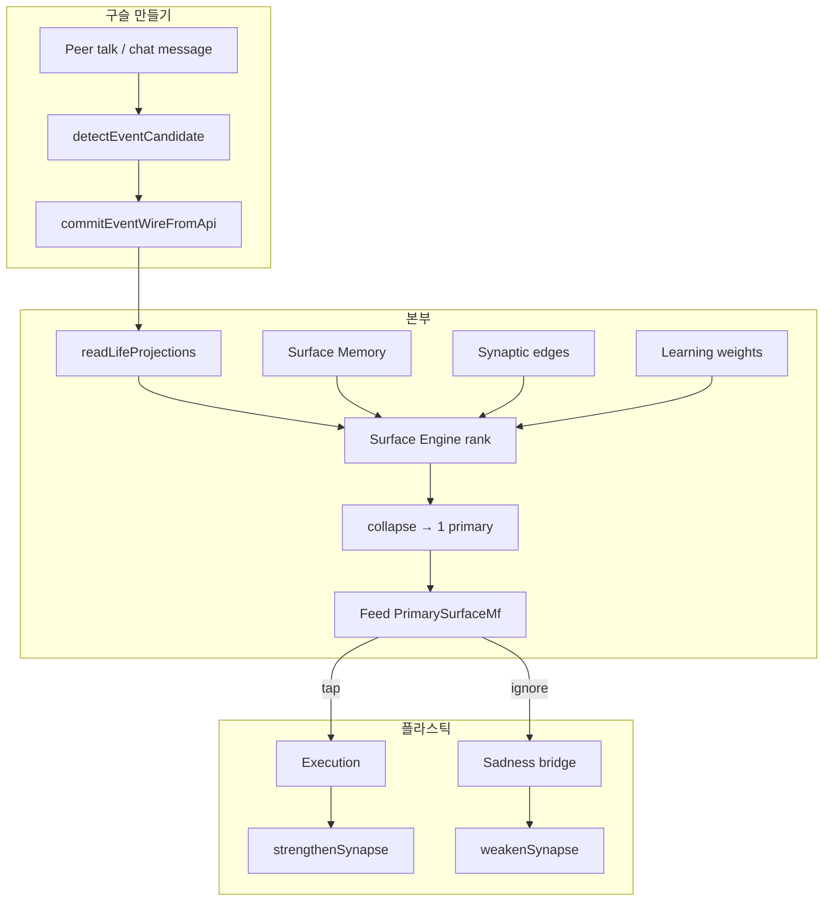

# Rimvio × Inside Out — system map (v1)

**Purpose:** One shared ontology for product, UX, and engine. IO names **what each module is for**.

**Canonical circuit (untangled):** [RIMVIO_CANONICAL_LOOP.md](./RIMVIO_CANONICAL_LOOP.md) — five layers, single marble write, ingress rules.

---

## 1. World map (1 page)

| Inside Out | Rimvio module | User sees |
|------------|---------------|-----------|
| **Headquarters (본부)** | Feed collapse → `layout.primary` | 피드 상단 **지금 할 일** 카드 1개 |
| **Joy (기쁨)** | Primary CTA + execution success | 액션 버튼, 완료 피드백 |
| **Sadness (슬픔)** | ignore timer, dismiss, `learningPaused` | 무시·나중에·학습 잠시 멈춤 |
| **Fear / Disgust (소심·까칠)** | `stability-pipeline`, overload collapse | 흔들림 방지, latent 숨김 |
| **Anger (버럭)** | critical band, urgent score | 긴급 일정 우선 |
| **Memory marble (구슬)** | `EventCandidate` (`mentioned` → …) | 대화/톡에서 감지된 “한 덩어리 일” |
| **Long-term / trash (야간 정리)** | Surface memory + synapse decay/prune | 완료·무시·가중치 감쇠 |
| **Core memory (핵심)** | `confirmed` / `scheduled` EC + high synapse | 오늘 본부에 올라오는 **진짜** 다음 행동 |
| **Islands (섬)** | `pattern-detector` + preference weights | 습관 스트립, capability/channel bias |
| **Train of thought** | Orchestrator + command router | 채팅·`@` 명령 (본부와 별 축) |



---

## 2. Closed loop (canonical — see full doc)

1. **SENSE** — Talk → `commitMarbleWire` → Event SSOT only  
2. **DECIDE** — SSOT + memory/synapse read → FEED **one** primary (no `surface:rimvio:*` HQ)  
3. **ACT / LEARN** — tap → execution → strengthen; ignore → sadness bridge → weaken  

Details: [RIMVIO_CANONICAL_LOOP.md](./RIMVIO_CANONICAL_LOOP.md)

---

## 3. P0 gaps (this pass)

| ID | IO | Gap | Implementation |
|----|-----|-----|----------------|
| **P0-1** | 구슬 | Peer talk → SSOT 없음 | `lib/inside-out/marble-ingest.ts` + `sendFeedPeerTalkInFeed` |
| **P0-2** | 핵심 라벨 | 버튼이 generic CTA | `deriveUserCoreActionLabel` on surface primary |
| **P0-3** | 슬픔 veto | 무시가 “방해” 톤만 | `peer_talk_marble` / `sadness_hold` why copy + ignore toast |

---

## 4. P1 (next)

| ID | IO | Work |
|----|-----|------|
| P1-1 | 섬 | Map categories → island labels in UI (우정·여행·가족) |
| P1-2 | 코어 색 | Multi-emotion core: ignore does not delete marble, only demotes |
| P1-3 | 본부 | Peer reply ingest (optional) + confirm chip before `confirmed` |

---

## 5. Module import rules

- **UI (`components/`, `hooks/`)** — no `@/lib/learning` direct; use composition bridges.  
- **Marble write** — only `commitEventWireFromApi` / `commitEventUpsert`.  
- **Plasticity write** — execution dispatcher, `surface-ignore-bridge`, synapse engine.

---

## 6. Verify

```bash
npm run test:inside-out-p0
npm run test:rimvio-v1-core
```
