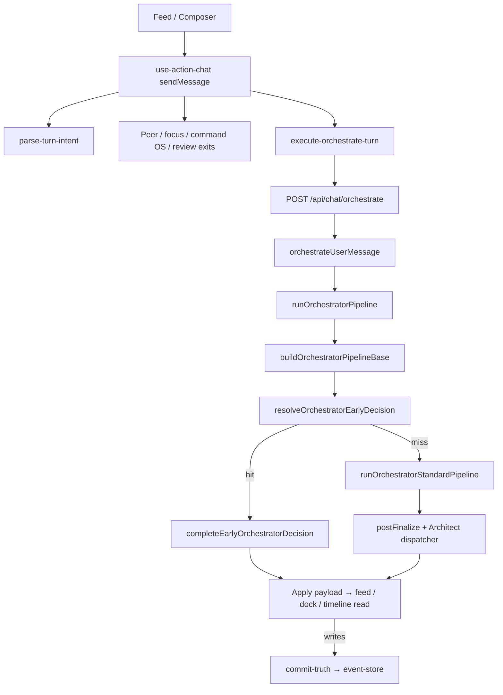
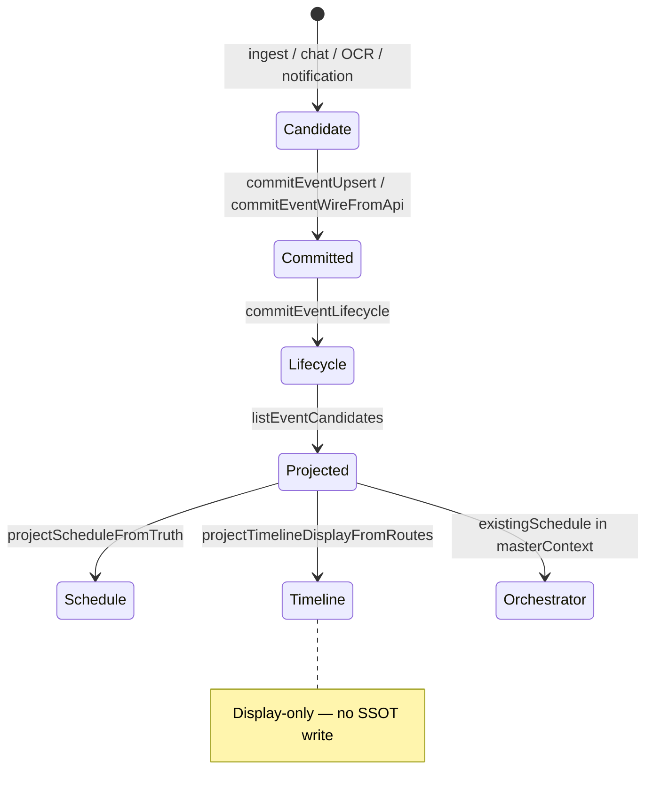

# Rimvio System Audit (2026-06-04)

Machine-readable MVP gate: `reports/mvp-verify-latest.json` (`npm run test:mvp` / `test:mvp:full`).

---

## 1. Directory Tree (product + engine)

```
new-project/
├── app/                    # Next.js routes, API (/api/chat/orchestrate, …)
├── components/             # Feed, composer, action cards, ambient shell
├── hooks/                  # use-action-chat.ts (client turn hub, ~2k LOC)
├── lib/
│   ├── action-chat/        # Orchestrator, turn/*, routing-patches, wire-to-actions
│   │   ├── orchestrator/   # run-orchestrator-pipeline (entry), resolve-* (~640 LOC)
│   │   └── turn/           # parse / route / execute-orchestrate-turn
│   ├── action-os/          # Session intent + correction state
│   ├── action-dispatcher/  # NAVIGATE etc. → deep links
│   ├── events/             # Event candidate store (SSOT storage)
│   ├── source-of-truth/    # commit-truth.ts (only write facade)
│   ├── timeline-projection/ # Display-only timeline
│   ├── schedule-intelligence/
│   ├── event-kernel/       # Conversation kernel + memory/search plans
│   └── goal-engine/
├── scripts/                # Boundary tests, mvp-verify-report.mjs
├── docs/                   # SOURCE_OF_TRUTH, ORCHESTRATOR_OS_LAYERS, this file
└── reports/                # mvp-verify-latest.json
```

---

## 2. Runtime Flow



**Read path:** master context from `resolveMasterContextFromTruth` / serialized event candidates — no schedule write on read.

**Write path:** ingest adapters → `commit-truth` only (see `docs/SOURCE_OF_TRUTH.md`).

---

## 3. Event Lifecycle Graph



Orchestrator **does not** append to the event store; schedule proposals return as wire and commit through explicit user/ingest paths.

---

## 4. Source Of Truth Audit

| Domain | SSOT | Write gate | Read projection |
|--------|------|------------|-----------------|
| Life / schedule events | `lib/events/event-store.ts` | `lib/source-of-truth/commit-truth.ts` | schedule + orchestrator context |
| Timeline UI | — (derived) | **Forbidden** on read | `lib/timeline-projection/` |
| Session navigate correction | `session-intent-state` (ephemeral) | commit on correction tier | action dispatcher URL |
| Chat turn cache | goal-engine turn cache | publish on turn only | snapshot in pipeline |

**Boundary tests (MVP core):** `test-write-path-boundary`, `test-timeline-read-only-boundary`.

**Violations to watch:** direct `event-store` upsert from UI; `existingSchedule` trusted over `eventCandidates` on server.

---

## 5. Ownership Map

| Layer | Owns | Must not |
|-------|------|----------|
| **Client hook** | Selection, composer axis, local egress to API | Truth commits |
| **Turn modules** (`lib/action-chat/turn/`) | Parse, route stubs, orchestrate HTTP | Engine probe logic |
| **Orchestrator** | Routing, enrichment, finalize, trace | UI strings in engine keys |
| **commit-truth** | Canonical event mutations | UI-driven read side effects |
| **Feed / globals.css** | Touch targets, sticky composer | Orchestrator ordering |

---

## 6. Bottleneck Report

| Hotspot | ~LOC | Risk | Mitigation |
|---------|------|------|------------|
| `hooks/use-action-chat.ts` | 2009 | Change blast radius | Continue turn/* extraction |
| `resolve-orchestrator-decision.ts` | 641 | Probe order regressions | Split `routing/probes/*`; routing-patches tests |
| `post-finalize` + architect dispatcher | medium | Latency on every turn | Early-return skip dispatcher when terminal |
| Full `npm test` | huge | CI time / flake | `test:mvp` + `test:mvp:full` as gate |
| Place discovery LLM paths | variable | Cost / timeout | Keep axis early routes |

**Recent fix:** correction vs frustration prefix collision (`아니야` / `아니`) — session correction now precedes frustration only when navigable or prior intent exists.

---

## 7. Missing Components Report

| Gap | Priority | Notes |
|-----|----------|-------|
| `routing/probes/*` split from monolith | P1 | Scaffold exists; AST-safe extract pending |
| `route-client-turn.ts` real handlers | P1 | Early exits still in hook |
| CI default on `test:mvp:full` | P2 | Wire in GitHub Actions |
| OpenClaw ↔ Rimvio closed loop | P3 | Docs in `ghostsilence-programmer`; optional Skill |
| Device E2E for feed composer sticky | P2 | Boundary test covers CSS; WebView manual verify |
| Probe-order regression test file | P2 | Partially covered in routing-patches + v2 |

---

## 8. Production Readiness Score

| Area | Score (1–5) | Comment |
|------|-------------|---------|
| Architecture / SSOT | 4.0 | Clear commit-truth boundary; tests green |
| Orchestrator maintainability | 3.0 | Entry split done; pre-pipeline still monolith |
| Client turn structure | 3.0 | execute-turn extracted; hook still large |
| Test / CI gate | 3.5 | `test:mvp:full` passes locally; not default CI |
| Deploy hygiene | 2.5 | Large uncommitted surface; staging smoke advised |
| Mobile UX (composer) | 3.5 | Sticky dock fix + boundary test |

**Overall: 3.2 / 5** — safe for staged MVP; not full production without CI gate + PR split + device pass.

---

## 9. Database Schema

**Primary store:** Supabase Postgres (`supabase/migrations/`). **Life-state SSOT** is **not** in SQL — it lives in client `event-store` + `commit-truth` (see §4).

| Domain | Tables / RPC | Role |
|--------|----------------|------|
| Links & actions | `links`, `link_actions`, `user_action_bins` | Saved URLs, action bins |
| Personalization | `user_action_events`, `user_link_states`, `user_recent_action_profile` | Click/impression learning; `record_personalization_click` RPC |
| Containers (legacy cloud) | `containers`, `container_events` | Goal containers + event log (parallel to local EventCandidate) |
| Place learning | `place_corrections` | AI vs user location corrections (sync with IndexedDB) |
| Integrations | `user_integrations`, `user_action_metadata` | OAuth / action metadata |
| Social / peer | `peer_chat`, `friend_connections`, `relationship_slots`, … | DM, profiles, RLS-hardened |
| Analytics | `analytics_events` | Product telemetry |

**Convergence rule:** Orchestrator schedule reads **projected** `eventCandidates[]` from truth resolver — not raw `container_events` rows.

Detail: [`docs/DATA_MODEL_REFERENCE.md`](./DATA_MODEL_REFERENCE.md#9-database-schema-supabase).

---

## 10. Action Registry 구조

**Module:** `lib/action-dispatcher/registry.ts` · **Catalog:** `lib/data-model/action-registry-catalog.ts`

```
ActionIntentWire { action_id, params, fallback_url, thought? }
        ↓
ACTION_INTENT_REGISTRY[id] → ActionIntentDefinition
        ↓ buildUrl(params)
DispatchedActionResult { type: EXECUTE | WEB_OPEN, url, label }
```

| ID | Params | Native / fallback |
|----|--------|-------------------|
| `NAVIGATE` | dest, destination | Kakao map search |
| `TAXI_CALL` | dest, destination | Kakao T |
| `NAVER_MAP_SEARCH` | query, dest | Naver map web |
| `TEL_CALL` | number, phone | tel: |
| `SMS_COMPOSE` | number, body | sms: |
| `TOSS_TRANSFER` / `KAKAOPAY_TRANSFER` | amount, bank | payment apps |
| `FLIGHT_CHECK` / `PACKING_CHECKLIST` | trip fields | rimvio:// trip |
| `WEB_SEARCH` / `YOUTUBE_OPEN` | query | web / youtube |

**Invariant:** LLM emits **IDs + params only** — never raw deep-link URLs (`action-intent-to-master-wire.ts`).

---

## 11. EventCandidate 타입 정의

**Schema lock:** `event-candidate.v1` — `lib/event-kernel/schema-lock/event-schema.ts`  
**Domain type:** `lib/events/event-candidate.ts`

```ts
EventCandidate {
  id, title,
  category: schedule | travel | finance | food | work | social | custom,
  source: message | notification | system,
  lifecycle: mentioned → candidate → confirmed → scheduled → active → completed → archived,
  datetime?, place?, containerId?,
  confidence, metadata?,
  lifecycleUpdatedAt, createdAt, updatedAt
}
```

**Wire (API):** `EventCandidateWire` — snake_case (`container_id`, `lifecycle_updated_at`). Validated on write via `validateEventCandidateWire` in `commit-truth.ts`.

**Detection:** `detectEventCandidate({ message, referenceDate })` — deterministic pre-pipeline signal (not SSOT until committed).

---

## 12. Learning 데이터 모델

Three layers — do not mix write paths:

| Layer | Store | Model | Purpose |
|-------|-------|-------|---------|
| **A. Self-learning loop** | Interaction log (file/API) | `InteractionRecord`, `FixProposal`, `SelfLearningReport` | Routing failures, regression gate, prompt/rule proposals |
| **B. Live turn telemetry** | Client → API | `LiveTurnLogEntry` / `LiveTurnRequest` | Per-turn routing metadata, latency, implicit signals |
| **C. Archive rollup** | `localStorage` `rimvio.learning-rollup.v1` | `LearningSignal` → `LearningRollupEntry` | Feed action shown/click/execute rates by contextKey |
| **D. Supabase personalization** | Postgres | `user_action_events` + profile JSON | Cross-session click affinity |
| **E. Place corrections** | Postgres + local | `CorrectionLogEntry`, `place_corrections` | Location confirm learning |

**Exports:** `lib/data-model/index.ts` · **Test:** `npm run test:data-model` → `scripts/test-data-model-catalog.ts`

---

## Ranked Roadmap

| Rank | Item | Status |
|------|------|--------|
| 1 | P0 — Probe order, MVP gate, SSOT boundaries | ✅ |
| 2 | P1 — Pre-pipeline probe modules (`security`, `session-correction`) | ✅ started |
| 3 | P1 — `resolveClientTurnRoute` + hook switch | ✅ started |
| 4 | P1 — Remaining probes (ux, discovery, event) | 🔲 |
| 5 | P1 — Execute handlers per `ClientTurnRoute` (thin hook) | 🔲 |
| 6 | P2 — `test:mvp:full` in CI + report artifact | 🔲 |
| 7 | P2 — EventCandidate cloud mirror (optional Supabase table) | 🔲 |
| 8 | P2 — Staging smoke (composer, orchestrate, commit-truth) | 🔲 |
| 9 | P3 — OpenClaw handoff (`ghostsilence-programmer`) | 🔲 |

---

## Autonomous implementation log

**2026-06-04 (session 1)**  
Probe order, `chat_axis` stamp, MVP SSOT tests, correction vs frustration.

**2026-06-04 (session 2)**  
- `PRE_PIPELINE_PROBE_ORDER`: kill switch, PII, content policy, session correction.  
- `lib/data-model/` catalog + `test-data-model-catalog`.  
- `resolveClientTurnRoute` wired in `use-action-chat`.  
- MVP core: +data-model-catalog, +client-turn-route.  
- Docs: §9–12 + [`DATA_MODEL_REFERENCE.md`](./DATA_MODEL_REFERENCE.md).

See `docs/ORCHESTRATOR_OS_LAYERS.md` for layer boundaries.
